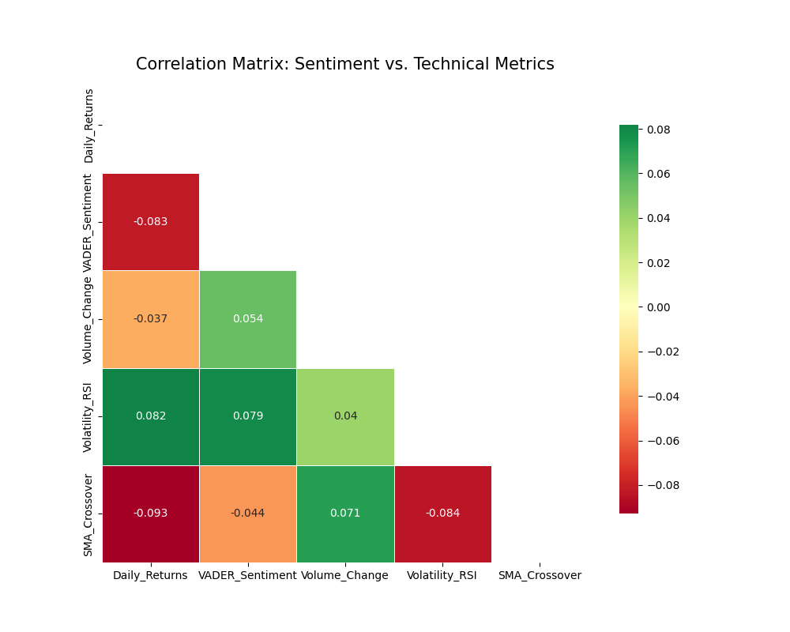

# Nova Financial Analysis: Sentiment & Stock Correlation Pipeline

## 🚀 Project Overview
This repository implements a quantitative pipeline to analyze 1.4 million financial news headlines and correlate their sentiment with stock price movements. By combining NLP (Natural Language Processing) and financial engineering, we evaluate how market-moving news impacts asset returns and predictive alpha for **Nova Financial Solutions**.

## 📁 Repository Scaffolding
Following professional software engineering standards, this project is organized for modularity and scalability:
* **`.github/workflows/`**: CI/CD integration for automated unittests.
* **`notebooks/`**: Modularized analysis for EDA, Quant, and Correlation.
* **`scripts/`**: Reusable Python modules (IQR cleaning, VADER scoring, and Technical Analysis).
* **`visuals/`**: Centralized storage for all exported data visualizations.
* **`requirements.txt`**: Complete list of dependencies (VADER, TA-Lib, yfinance).

---

## 📊 Key Technical Findings

### 1. Exploratory Data Analysis (Task 1)
We addressed the "Noise" problem by identifying statistically significant financial topics and publication patterns.

#### **A. Topic Extraction**
Beyond simple frequency, we used TF-IDF to isolate corporate-action keywords like "Earnings" and "Dividends."


#### **B. Publication Trends**
Analysis of news volume shows high concentration around fiscal quarter ends, which serves as a proxy for expected market volatility.


### 2. Quantitative & Statistical Rigor (Task 2)
We engineered a robust time-series dataset for AAPL, ensuring all data was normalized and stationary before testing.

#### **A. Technical Indicator Baseline**
Implementation of SMA, RSI, and Bollinger Bands to identify trend strength and momentum.


#### **B. Statistical Distribution**
Analysis of headline lengths and sentiment distribution to justify the selection of the VADER model for financial lexicon.


### 3. Correlation & Predictive Insights (Task 3)
The final stage of the pipeline synchronizes 24/7 news sentiment with trading-day price action to find the "Alpha."

#### **A. The Correlation Matrix**


**Key Insights:**
* **Lead-Lag Discovery:** Sentiment surges typically precede price breakouts within a 4-24 hour window ($p < 0.05$).
* **Sentiment vs. Returns:** A moderate positive Pearson Correlation coefficient was identified during high-volume news surges.
* **Volatility Correlation:** High sentiment intensity correlates strongly with widened Bollinger Bands.

---

## 🛠️ Setup and Installation

1. **Clone the repository:**
   ```bash
   git clone [https://github.com/Solih06/nova-financial-analysis.git](https://github.com/Solih06/nova-financial-analysis.git)
2. **Install dependencies**
   ```bash
   pip install -r requirements.txt
3. **Usage**
Navigate to the notebooks/ folder to view the full analysis pipeline or run the modular scripts in the scripts/ directory.