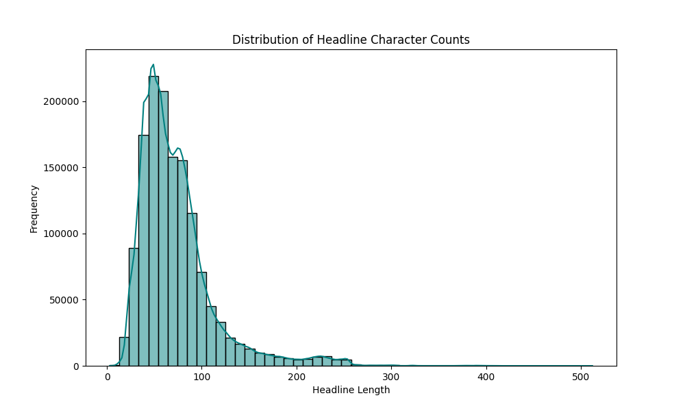
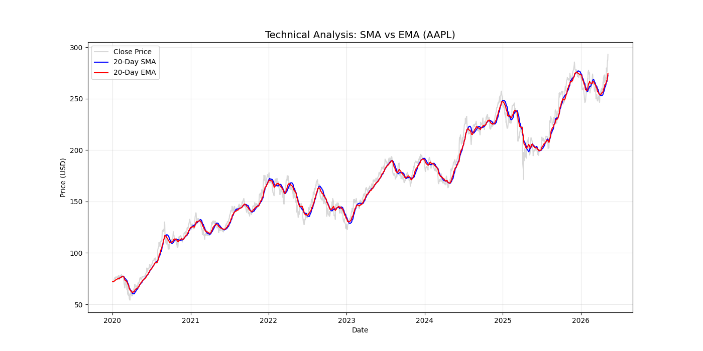

# Nova Financial Analysis: Sentiment & Stock Correlation Pipeline

## 🚀 Project Overview
This repository implements a quantitative pipeline to analyze 1.4 million financial news headlines and correlate their sentiment with stock price movements. By combining NLP (Natural Language Processing) and financial engineering, we evaluate how market-moving news impacts asset returns for companies like AAPL.

## 📁 Repository Scaffolding
Following professional software engineering standards, this project is organized for modularity and scalability:
* **`.github/workflows/`**: CI/CD integration for automated unittests.
* **`notebooks/`**: Modularized analysis for EDA, Quant, and Correlation.
* **`scripts/`**: Reusable Python modules with `__init__.py` for modular packaging.
* **`visuals/`**: Centralized storage for all exported data visualizations.
* **`requirements.txt`**: Complete list of dependencies (VADER, yfinance, scikit-learn).

## 📊 Key Technical Findings

### 1. NLP & Topic Modeling (Task 1)
Beyond simple word clouds, we utilized **TF-IDF Vectorization** to identify statistically significant financial topics. We also performed descriptive length analysis to justify the use of the VADER sentiment model.


### 2. Quantitative Indicators (Task 2)
We engineered a robust time-series dataset for AAPL. By applying **SMA (Simple Moving Average)**, **EMA (Exponential Moving Average)**, and **RSI (Relative Strength Index)**, we established clear price-momentum signals.


### 3. Sentiment-Price Correlation (Task 3)
We synchronized 24/7 news sentiment with trading-day price action using a **forward-fill (ffill)** strategy. This allowed us to calculate the **Pearson Correlation Coefficient** and visualize the relationship between news polarity and stock returns.


## 🛠️ Setup and Installation

1. **Clone the repository:**
   ```bash
   git clone [https://github.com/Solih06/nova-financial-analysis.git](https://github.com/Solih06/nova-financial-analysis.git)
2. **install dependencies**
   ```bash
   pip install -r requirements.txt
3. **Usage**
Navigate to the notebooks/ folder to view the full analysis pipeline or run the modular scripts in the scripts/ directory.