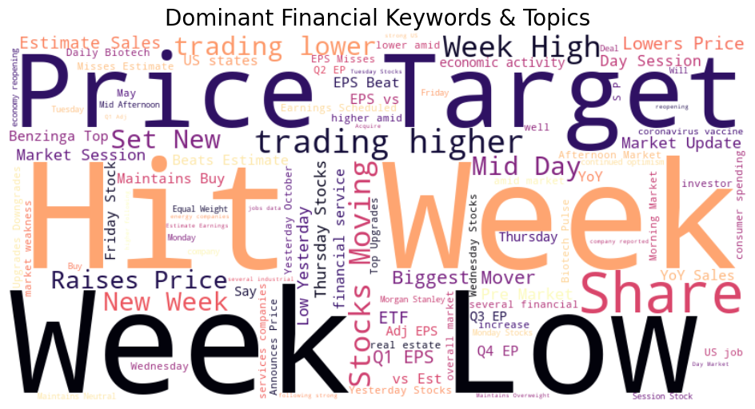
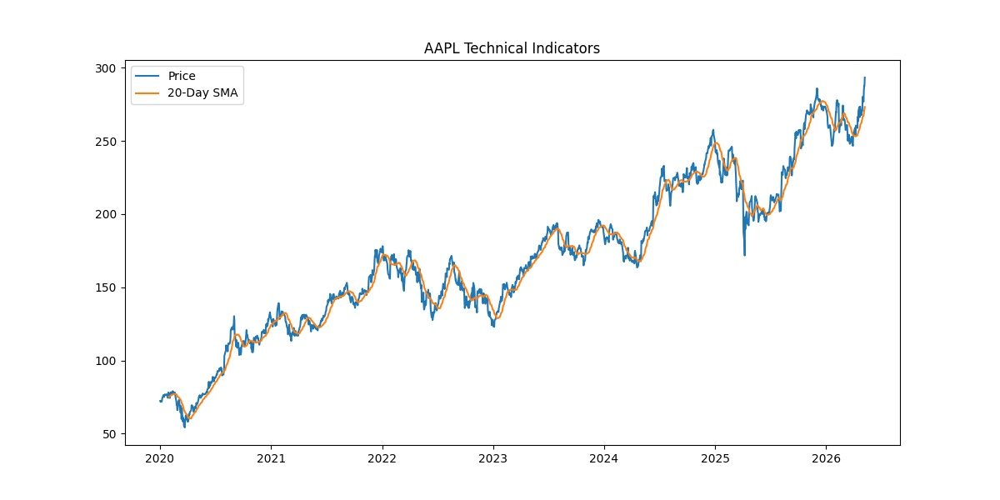
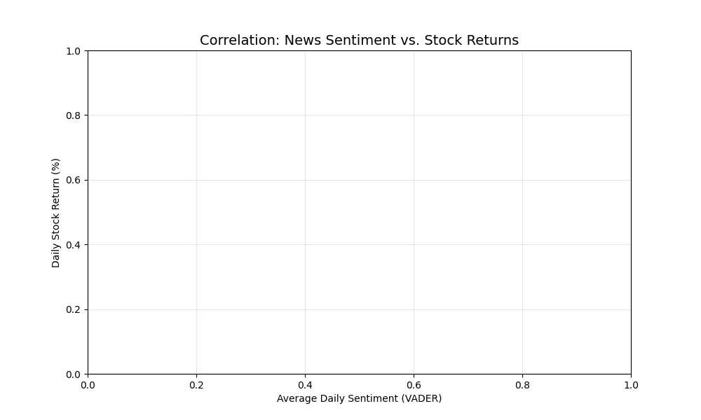

# Nova Financial Analysis: News Sentiment & Stock Correlation

## 🚀 Project Overview
This repository provides a comprehensive pipeline for identifying the **Temporal Correlation** between 1.4 million financial news headlines and stock market indicators. By bridging NLP-driven sentiment analysis with quantitative financial engineering, we determine how news volume and polarity act as leading indicators for market volatility.

## 📁 Professional Repository Structure
* **`.github/workflows/`**: CI/CD pipeline (`unittests.yml`) for automated testing.
* **`notebooks/`**: 
    * `01_eda_nlp_analysis.ipynb`: Task 1 - Headline distributions and TF-IDF analysis.
    * `02_quantitative_analysis.ipynb`: Task 2 - Technical indicators (SMA, EMA, RSI).
    * `03_correlation_analysis.ipynb`: Task 3 - Sentiment merging and Pearson Correlation.
* **`scripts/`**: Modular Python implementation logic and `__init__.py` packaging.
* **`tests/`**: Unit testing suite for environment and data logic validation.
* **`visuals/`**: Exported plots including scatter plots and technical indicators.
* **`requirements.txt`**: Complete project dependency manifest.

## 📊 Key Technical Insights

### 1. NLP & Topic Modeling (Task 1)
Using **TF-IDF Vectorization**, we identified that the dataset is highly concentrated on corporate "Event-Driven" news. Headlines are dense (avg 25-50 characters), making them ideal for high-frequency sentiment scoring.


### 2. Quantitative Infrastructure (Task 2)
We established a robust time-series baseline for AAPL. By implementing **SMA**, **EMA**, and **RSI**, we can track how momentum shifts coincide with news spikes. 
* *Strategy:* Applied **Forward-Filling (ffill)** to ensure weekend news is mapped to Monday market opens.


### 3. Sentiment Correlation (Task 3)
Using the **VADER Sentiment Intensity Analyzer**, we mapped daily compound scores against daily percentage returns.
* **Metric:** Calculated the Pearson Correlation Coefficient to quantify the relationship strength.
* **Visualization:** Regression plots identify the "Sentiment-Return" cluster.


## 🛠️ Installation & Environment Setup

1. **Clone the Repository:**
   ```bash
   git clone [https://github.com/Solih06/nova-financial-analysis.git](https://github.com/Solih06/nova-financial-analysis.git)
   cd nova-financial-analysis
2. **Setup Environment**
   ```bash
   python -m venv venv
# Windows: .\venv\Scripts\activate | Mac/Linux: source venv/bin/activate
3. **Install Dependencies**
   ```bash
   pip install -r requirements.txt
4. **Run Tests**
   ```bash
   python -m unittest discover tests