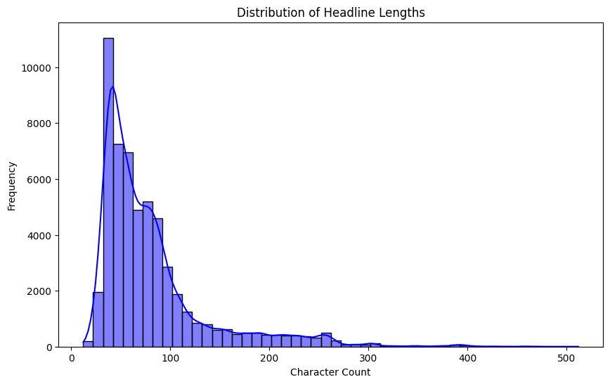
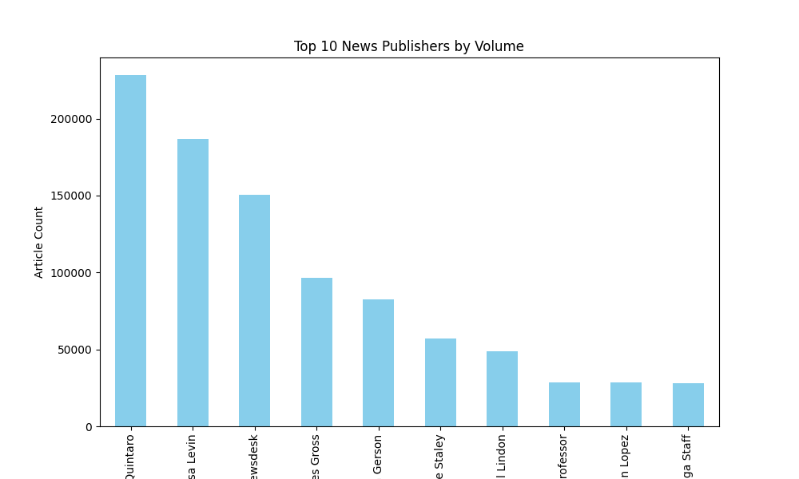
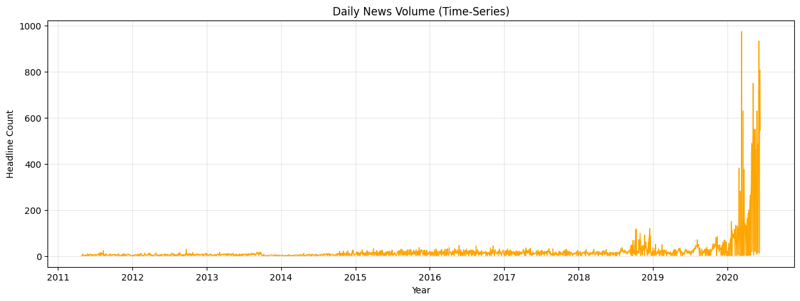

# Nova Financial Solutions - Stock Sentiment Analysis

## 📊 Project Overview
This repository contains the analysis and data pipeline for identifying correlations between financial news sentiment and stock market movements.

## 🚀 Task 1: Exploratory Data Analysis (EDA)
In this phase, I established the project structure and analyzed the **FNSPID** dataset to uncover key insights.

### 1. Headline Length Distribution
Most headlines are concise, peaking between **25-50 characters**, which is typical for real-time financial alerts.

### 2. Top Publishers
**Benzinga** is the primary contributor to this dataset, followed by other high-volume financial news desks.

### 3. Publication Trends
We identified significant news volume spikes in **2020**, aligning with major global economic shifts and market volatility.

## 📂 Project Structure
- `data/`: Raw and processed stock/news data.
- `notebooks/`: EDA and analysis notebooks.
- `scripts/`: Modular Python scripts for data fetching (Task 2).
- `visuals/`: Charts generated during analysis.

## 🛠️ Setup
1. Clone the repo.
2. Install dependencies: `pip install -r requirements.txt`.