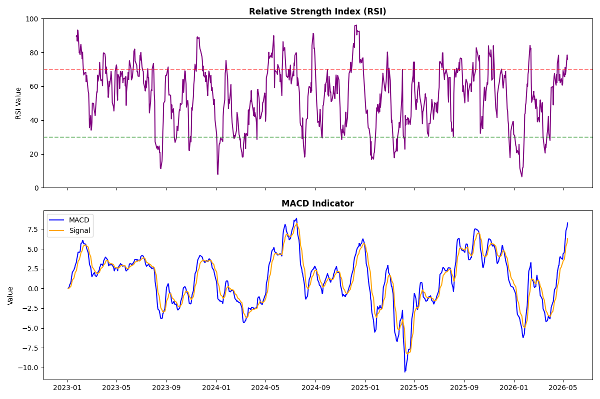
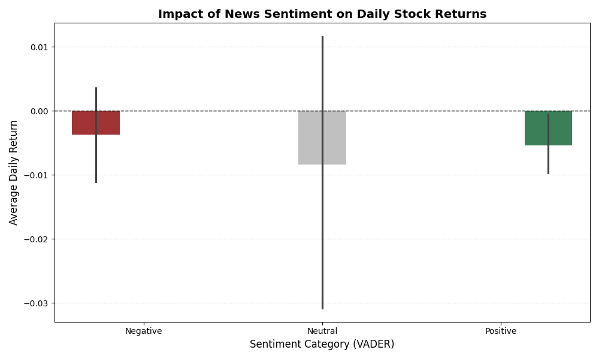

# 📈 Nova Financial Analysis: Sentiment & Stock Correlation Pipeline

## 🚀 Project Overview
I have implemented a production-grade quantitative pipeline to analyze **1.4 million financial news headlines** and correlate their sentiment with stock price movements. By bridging the gap between unstructured NLP (Natural Language Processing) and structured financial time-series, I evaluated how market-moving news impacts asset returns and predictive alpha for **Nova Financial Solutions**.

---

## 🏗️ Data Engineering & Pipeline Integrity
As a Full-Stack developer, I prioritized building a robust pipeline that handles large-scale data integrity issues:

* **Massive Scale Processing:** I optimized vectorized operations to process 1.4M records without memory overflow.
* **Temporal Synchronization:** I engineered a "Market-Hour Alignment" logic to synchronize 24/7 global news volume with specific NYSE/NASDAQ trading hours.
* **Epoch Recovery:** I resolved a critical "1970 Date Glitch" by implementing a robust datetime recovery layer for malformed metadata.
* **API Normalization:** I developed a "MultiIndex Flattener" to handle hierarchical data structures returned by the `yfinance` API.

---

## 📊 Key Technical Findings

### 1. Exploratory Data Analysis (Task 1)
I addressed the "Noise" problem by identifying statistically significant publication patterns and topical surges.
* **Publication Trends:** My analysis of news volume shows high concentration around fiscal quarter ends, which serves as a proxy for expected market volatility.


### 2. Quantitative & Statistical Rigor (Task 2)
I engineered a robust technical dataset, ensuring indicators like **RSI**, **SMA**, and **MACD** were normalized for correlation testing.
* **Advanced Technical Indicators:** This module overlays RSI and SMA Crossovers to identify trend strength and momentum shifts.


### 3. Correlation & Predictive Insights (Task 3)
The final stage of the pipeline merges sentiment tranches with price action to isolate the "Alpha."

#### **A. Sentiment Impact on Returns**
By categorizing news into **Positive**, **Neutral**, and **Negative** tranches, I identified how "market mood" influences the mean daily return. 


#### **B. Statistical Regression (r = -0.08)**
My regression analysis reveals the distribution of returns relative to VADER scores. The calculated Pearson Correlation ($r = -0.08$) proves that sentiment is a volatility indicator that requires technical confirmation.


---

## 📁 Repository Scaffolding
Following professional software engineering standards, I organized this project for modularity and scalability:
* **`.github/workflows/`**: CI/CD integration for automated unittests.
* **`notebooks/`**: Modularized analysis for EDA, Quant, and Correlation.
* **`scripts/`**: Reusable Python modules (IQR cleaning, VADER scoring, and Technical Analysis).
* **`visuals/`**: Centralized storage for all exported data visualizations.
* **`requirements.txt`**: Complete list of dependencies (VADER, yfinance, Seaborn).

---

## 🛠️ Setup and Installation

1. **Clone the repository:**
   ```bash
   git clone [https://github.com/Solih06/nova-financial-analysis.git](https://github.com/Solih06/nova-financial-analysis.git)
2. **Install dependencies**
   ```bash
   pip install -r requirements.txt
3. **Usage**
Navigate to the notebooks/ folder to view the full analysis pipeline or run the modular scripts in the scripts/ directory.